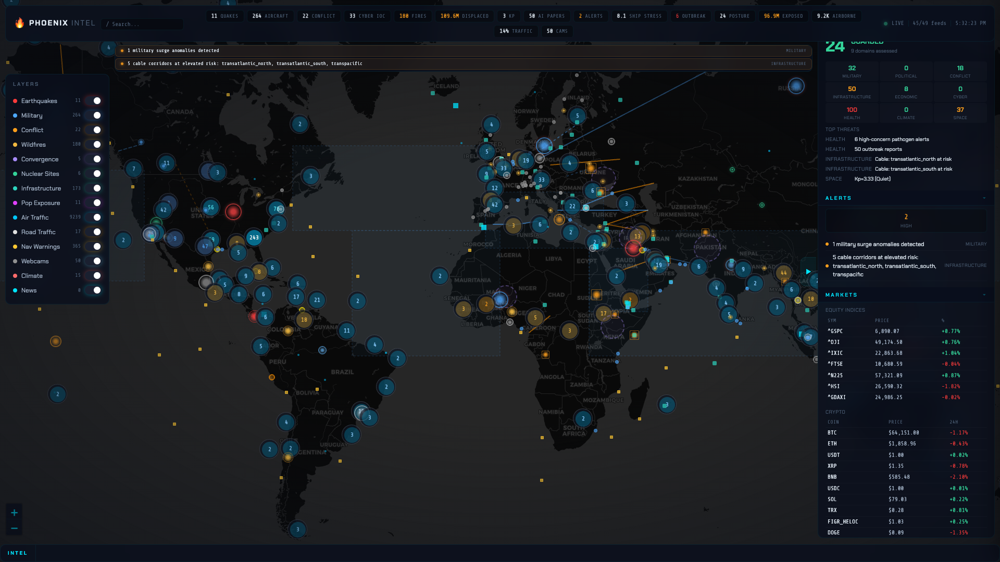

[](https://mseep.ai/app/marc-shade-world-intel-mcp)



# World Intelligence MCP Server

[](https://modelcontextprotocol.io)
[](https://python.org)
[](LICENSE)

Real-time global intelligence across **30+ domains** with **109 MCP tools**, a live ops-center dashboard, a CLI, and a **Qdrant vector store** for enterprise-grade semantic search across accumulated intelligence. All data comes from free, public APIs — no paid subscriptions required.

Built for AI agents that need world awareness: market conditions, geopolitical risk, military posture, supply chain disruptions, cyber threats, and more — all queryable via the Model Context Protocol. The vector store enables natural language queries like *"military activity near Taiwan"* or *"cyber threats targeting healthcare"* across all historical data.

---

## What You Get

| Domain | Tools | Data Sources |
|--------|-------|-------------|
| **Financial Markets** | 7 | Yahoo Finance, CoinGecko, Alternative.me, Mempool |
| **Forex & Currency** | 3 | ECB/Frankfurter (8 major pairs, timeseries, cross rates) |
| **Bonds & Yields** | 2 | FRED, Yahoo Finance (yield curve, bond ETFs, spread analysis) |
| **Earnings** | 2 | Yahoo Finance (mega-cap calendar, surprise history) |
| **SEC Filings** | 3 | SEC EDGAR (full-text search, company filings, 8-K material events) |
| **Company Enrichment** | 1 | Yahoo Finance + GDELT + SEC + GitHub (composite profile) |
| **Macro Composite** | 1 | Weighted 6-signal market verdict (Fear&Greed, VIX, sectors, DXY, BTC, yields) |
| **Economic Indicators** | 3 | EIA energy, FRED macro, World Bank |
| **Central Banks** | 1 | 8 central bank policy rates |
| **BTC Technicals** | 1 | SMA 50/200, golden/death cross, Mayer Multiple |
| **Natural Disasters** | 2 | USGS earthquakes, NASA FIRMS wildfires |
| **Environmental** | 2 | NASA EONET, GDACS disaster alerts |
| **Climate** | 1 | Open-Meteo temperature/precipitation anomalies |
| **Conflict & Security** | 4 | ACLED events, UCDP, unrest detection, humanitarian data |
| **Military & Defense** | 6 | adsb.lol, OpenSky, hexdb.io, surge detection, theater posture, aircraft batch |
| **Infrastructure** | 4 | Cloudflare Radar, submarine cables, cascade analysis, cloud status |
| **Maritime** | 2 | NGA navigation warnings, vessel snapshots |
| **Aviation** | 2 | FAA airport delays, domestic flight snapshot |
| **News & Media** | 3 | 80+ RSS feeds (4-tier), GDELT, trending keywords |
| **Intelligence Analysis** | 8 | Signal convergence, focal points, instability index, risk scores, escalation |
| **NLP Intelligence** | 4 | Entity extraction, event classification, news clustering, keyword spikes |
| **Strategic Synthesis** | 4 | Strategic posture, world brief, fleet report, population exposure |
| **Geospatial** | 11 | Military bases, ports, pipelines, nuclear facilities, cables, datacenters, spaceports, minerals, exchanges, trade routes, cloud regions |
| **AI & Technology** | 4 | arXiv papers, HuggingFace models, Hacker News, GitHub trending |
| **Cyber Threats** | 1 | URLhaus, Feodotracker, CISA KEV, SANS |
| **Health** | 1 | WHO DON, ProMED, CIDRAP disease outbreaks |
| **Space Weather** | 1 | NOAA SWPC (Kp index, solar flares, alerts) |
| **Social & Sanctions** | 3 | Reddit velocity, OFAC SDN list, nuclear test site monitoring |
| **Country Intelligence** | 3 | Country brief, country stocks, financial centers |
| **Prediction Markets** | 1 | Polymarket event contracts |
| **Elections** | 1 | Global election calendar with risk scoring |
| **Displacement** | 1 | UNHCR refugee/IDP data |
| **Shipping** | 1 | Dry bulk shipping stress index |
| **Government** | 1 | USAspending.gov federal contracts |
| **Traffic** | 2 | Road traffic flow, real-time incidents |
| **Cross-Domain Alerts** | 2 | Alert digest, weekly trends |
| **Monitoring** | 2 | Webcams, server health/status |
| **Vector Search** | 5 | Qdrant semantic search, similarity, timeline, stats |
| **Cross-Domain Analytics** | 3 | Correlation, domain summary, trend detection |
| **Reports** | 1 | PDF/HTML multi-domain intelligence reports |

**Total: 110 tools** across 30+ intelligence domains.

---

## Quick Start

### Install

```bash
git clone https://github.com/marc-shade/world-intel-mcp.git
cd world-intel-mcp
pip install -e .

# Optional extras
pip install -e ".[dashboard]"  # Live ops-center dashboard
pip install -e ".[vector]"     # Qdrant vector store + FastEmbed
pip install -e ".[dev]"        # pytest, respx, coverage
```

### Run as MCP Server

```bash
world-intel-mcp  # stdio mode for Claude Code, Cursor, etc.
```

### Claude Code Configuration

Add to `~/.claude.json`:

```json
{
  "mcpServers": {
    "world-intel-mcp": {
      "command": "world-intel-mcp"
    }
  }
}
```

### Dashboard

```bash
intel-dashboard              # http://localhost:8501
intel-dashboard --port 9000  # custom port
```

### PDF/HTML Reports

```bash
pip install -e ".[pdf]"      # requires: brew install pango (macOS)
intel report                 # full PDF report → ~/.cache/world-intel-mcp/
intel report --format html   # HTML (no native deps needed)
intel report -o brief.pdf    # custom output path
intel report -s markets,cyber,earthquakes  # select sections
```

Map-first ops center: Leaflet map with toggle-able layers (quakes, military, conflict, fires, convergence, nuclear, infrastructure), 35+ live SSE feeds, HUD bar, glassmorphic panels, per-source circuit breaker health.

### CLI

```bash
intel markets              # stock indices
intel earthquakes --min-mag 5.0
intel status               # cache + circuit breaker health
```

---

## Architecture

```
server.py     (MCP stdio) ─┐                                               ┌─ VectorStore (Qdrant)
cli.py        (Click CLI)  ├─> sources/*.py ─> Fetcher ─> CircuitBreaker ─┤
dashboard.py  (SSE)        │    analysis/*.py                              └─ Cache (SQLite)
collector.py  (daemon)    ─┘
```

- **Fetcher**: Centralized async HTTP client (httpx). Retries, per-source rate limiting, stale-data fallback. Auto-stores results in vector store on fresh fetches.
- **CircuitBreaker**: Per-source tracking. 3 consecutive failures trips for 5 minutes. Each RSS feed gets its own breaker.
- **Cache**: SQLite WAL-mode TTL cache. `get()` returns live data, `get_stale()` returns expired data for fallback.
- **VectorStore**: Qdrant + FastEmbed (BAAI/bge-small-en-v1.5, 384-dim). Async background worker queue for non-blocking storage. Enables semantic search across all accumulated intelligence.
- **Collector**: Standalone daemon that fetches all 43 sources in parallel and populates the vector store. Run once or as a daemon (default: 5-minute interval).
- **Sources** (`sources/*.py`): 30+ modules, each exports `async def fetch_*(fetcher, **kwargs) -> dict`.
- **Analysis** (`analysis/*.py`): Cross-domain synthesis — signal aggregation, instability indexing, NLP, company enrichment, macro composite.
- **Config** (`config/*.py`): Curated datasets — 22 hotspots, 70+ bases, 40 ports, 24 pipelines, 24 nuclear facilities, 34 cables, 48 datacenters, 27 spaceports, 82 exchanges.

---

## MCP Tools Reference

### Financial Markets (7)
| Tool | Description |
|------|-------------|
| `intel_market_quotes` | Stock index quotes (S&P 500, Dow, Nasdaq, FTSE, Nikkei) |
| `intel_crypto_quotes` | Top crypto prices and market caps from CoinGecko |
| `intel_stablecoin_status` | Stablecoin peg health (USDT, USDC, DAI, FDUSD) |
| `intel_etf_flows` | Bitcoin spot ETF prices and volumes |
| `intel_sector_heatmap` | US equity sector performance (11 SPDR ETFs) |
| `intel_macro_signals` | 7 macro indicators (Fear & Greed, VIX, DXY, gold, 10Y, BTC) |
| `intel_commodity_quotes` | Commodity futures (gold, silver, crude, natgas, grains) |

### Forex & Currency (3)
| Tool | Description |
|------|-------------|
| `intel_forex_rates` | Latest FX rates from ECB. Filter by base/target currencies |
| `intel_forex_timeseries` | Historical FX rate with trend analysis (configurable days) |
| `intel_major_crosses` | All 8 major pairs + cross rates + DXY proxy |

### Bonds & Yields (2)
| Tool | Description |
|------|-------------|
| `intel_yield_curve` | US Treasury yield curve (2Y-30Y), 2s10s/3m10y spreads, inversion flag |
| `intel_bond_indices` | Bond ETFs: AGG, TLT, HYG, LQD, TIP with price/change |

### Earnings (2)
| Tool | Description |
|------|-------------|
| `intel_earnings_calendar` | Upcoming earnings for 20 mega-cap stocks with EPS estimates |
| `intel_earnings_surprise` | Historical earnings surprise (actual vs estimate, trend) |

### SEC Filings (3)
| Tool | Description |
|------|-------------|
| `intel_sec_filings` | Full-text search across all EDGAR filings |
| `intel_company_filings` | Company filings by ticker (10-K, 10-Q, 8-K) with CIK resolution |
| `intel_recent_8k` | Latest 8-K material events (M&A, exec changes, earnings) |

### Company Enrichment (1)
| Tool | Description |
|------|-------------|
| `intel_company_profile` | Composite profile: stock quote + financials + news + SEC + GitHub |

### Macro Composite (1)
| Tool | Description |
|------|-------------|
| `intel_macro_composite` | Weighted market score (0-100) with verdict: RISK_ON to STRONG_CAUTION |

### Economic (3)
| Tool | Description |
|------|-------------|
| `intel_energy_prices` | Brent/WTI crude oil and natural gas from EIA |
| `intel_fred_series` | FRED economic data (GDP, CPI, unemployment, rates) |
| `intel_world_bank_indicators` | World Bank development indicators by country |

### Central Banks (1)
| Tool | Description |
|------|-------------|
| `intel_central_bank_rates` | Policy rates for 8 major central banks |

### BTC Technicals (1)
| Tool | Description |
|------|-------------|
| `intel_btc_technicals` | Bitcoin SMA 50/200, golden/death cross, Mayer Multiple |

### Natural Disasters (2)
| Tool | Description |
|------|-------------|
| `intel_earthquakes` | USGS earthquakes (configurable magnitude/time/limit) |
| `intel_wildfires` | NASA FIRMS satellite fire hotspots (9 global regions) |

### Environmental (2)
| Tool | Description |
|------|-------------|
| `intel_environmental_events` | NASA EONET natural events |
| `intel_disaster_alerts` | GDACS disaster alerts with severity scoring |

### Conflict & Security (4)
| Tool | Description |
|------|-------------|
| `intel_acled_events` | ACLED armed conflict events |
| `intel_ucdp_events` | Uppsala Conflict Data Program events |
| `intel_unrest_events` | Social unrest with Haversine dedup |
| `intel_humanitarian_summary` | HDX humanitarian crisis datasets |

### Military & Defense (6)
| Tool | Description |
|------|-------------|
| `intel_military_flights` | Military aircraft via adsb.lol (OpenSky fallback) |
| `intel_theater_posture` | Activity across 5 theaters (EU, Indo-Pacific, ME, Arctic, Korea) |
| `intel_aircraft_details` | Aircraft lookup by ICAO24 hex (hexdb.io) |
| `intel_aircraft_batch` | Batch aircraft lookup (multiple hex codes) |
| `intel_military_surge` | Foreign aircraft concentration anomaly detection |
| `intel_usni_fleet` | USNI News naval fleet tracker |

### Infrastructure (4)
| Tool | Description |
|------|-------------|
| `intel_internet_outages` | Cloudflare Radar internet disruptions |
| `intel_cable_health` | Submarine cable corridor health |
| `intel_cascade_analysis` | Infrastructure cascade simulation |
| `intel_service_status` | Cloud platform health (AWS, Azure, GCP, Cloudflare, GitHub) |

### Maritime (2)
| Tool | Description |
|------|-------------|
| `intel_nav_warnings` | NGA maritime navigation warnings |
| `intel_vessel_snapshot` | Naval activity at 9 strategic waterways |

### Geospatial Datasets (10)
| Tool | Description |
|------|-------------|
| `intel_military_bases` | 70 military bases from 9 operators |
| `intel_strategic_ports` | 40 strategic ports across 6 types |
| `intel_pipelines` | 24 oil/gas/hydrogen pipelines |
| `intel_nuclear_facilities` | 24 nuclear power/enrichment/research facilities |
| `intel_undersea_cables` | 34 submarine communications cables |
| `intel_ai_datacenters` | 48 AI/HPC datacenters worldwide |
| `intel_spaceports` | 27 global spaceports |
| `intel_critical_minerals` | 27 strategic mineral deposits |
| `intel_stock_exchanges` | 82 stock exchanges worldwide |
| `intel_trade_routes` | Major trade routes and chokepoints |

### News & Media (3)
| Tool | Description |
|------|-------------|
| `intel_news_feed` | 80+ global RSS feeds with 4-tier source ranking |
| `intel_trending_keywords` | Trending terms with spike detection |
| `intel_gdelt_search` | GDELT 2.0 global news search |

### Intelligence Analysis (8)
| Tool | Description |
|------|-------------|
| `intel_signal_convergence` | Geographic convergence of multi-domain signals |
| `intel_focal_points` | Multi-signal focal point detection |
| `intel_signal_summary` | Country-level signal aggregation |
| `intel_temporal_anomalies` | Activity deviations from baselines |
| `intel_instability_index` | Country Instability Index v2 (0-100) |
| `intel_risk_scores` | ACLED-based conflict risk scoring |
| `intel_hotspot_escalation` | Escalation scores for 22 intel hotspots |
| `intel_country_dossier` | Comprehensive country intelligence dossier |

### NLP Intelligence (4)
| Tool | Description |
|------|-------------|
| `intel_extract_entities` | Named entity extraction (countries, leaders, orgs, CVEs, APTs) |
| `intel_classify_event` | Event classification into 14 threat categories |
| `intel_news_clusters` | Topic clustering by Jaccard similarity |
| `intel_keyword_spikes` | Keyword spike detection with Welford's algorithm |

### Strategic Synthesis (4)
| Tool | Description |
|------|-------------|
| `intel_strategic_posture` | Composite global risk from 9 weighted domains |
| `intel_world_brief` | Structured daily intelligence summary |
| `intel_fleet_report` | Naval fleet activity report with readiness scoring |
| `intel_population_exposure` | Population at risk near active events (105-city dataset) |

### Climate (1)
| Tool | Description |
|------|-------------|
| `intel_climate_anomalies` | Open-Meteo temperature/precipitation anomalies |

### Prediction Markets (1)
| Tool | Description |
|------|-------------|
| `intel_prediction_markets` | Polymarket prediction contracts |

### Elections (1)
| Tool | Description |
|------|-------------|
| `intel_election_calendar` | Global election calendar with risk scoring |

### Displacement (1)
| Tool | Description |
|------|-------------|
| `intel_displacement_summary` | UNHCR refugee/IDP statistics |

### Aviation (2)
| Tool | Description |
|------|-------------|
| `intel_airport_delays` | FAA airport delay status |
| `intel_aviation_domestic` | Global air traffic snapshot from OpenSky |

### Cyber Threats (1)
| Tool | Description |
|------|-------------|
| `intel_cyber_threats` | Aggregated cyber intel (URLhaus, CISA KEV, SANS) |

### Space Weather (1)
| Tool | Description |
|------|-------------|
| `intel_space_weather` | Solar activity (Kp index, X-ray flux, SWPC alerts) |

### AI & Technology (4)
| Tool | Description |
|------|-------------|
| `intel_ai_releases` | arXiv AI papers, HuggingFace models |
| `intel_hacker_news` | Hacker News top stories |
| `intel_trending_repos` | GitHub trending repositories |
| `intel_arxiv_papers` | arXiv paper search |

### Health (1)
| Tool | Description |
|------|-------------|
| `intel_disease_outbreaks` | WHO DON, ProMED, CIDRAP outbreaks |

### Social & Sanctions (3)
| Tool | Description |
|------|-------------|
| `intel_social_signals` | Reddit geopolitical discussion velocity |
| `intel_sanctions_search` | OFAC SDN list search |
| `intel_nuclear_monitor` | Seismic monitoring near nuclear test sites |

### Shipping & Trade (1)
| Tool | Description |
|------|-------------|
| `intel_shipping_index` | Dry bulk shipping stress index |

### Government (1)
| Tool | Description |
|------|-------------|
| `intel_usa_spending` | USAspending.gov federal contracts |

### Country Intelligence (3)
| Tool | Description |
|------|-------------|
| `intel_country_brief` | Quick country situation summary |
| `intel_country_stocks` | Stock exchanges and listings by country |
| `intel_financial_centers` | Global financial centers ranking |

### Extended Geospatial (1)
| Tool | Description |
|------|-------------|
| `intel_cloud_regions` | Cloud provider regions worldwide |

### Traffic (2)
| Tool | Description |
|------|-------------|
| `intel_traffic_flow` | Road traffic flow data |
| `intel_traffic_incidents` | Real-time traffic incidents |

### Cross-Domain Alerts (2)
| Tool | Description |
|------|-------------|
| `intel_alert_digest` | Cross-domain alert aggregation |
| `intel_weekly_trends` | Weekly trend analysis |

### Monitoring (2)
| Tool | Description |
|------|-------------|
| `intel_webcams` | Public webcam locations and live previews |
| `intel_status` | Server health, cache stats, circuit breaker status |

### Vector Search (5)
| Tool | Description |
|------|-------------|
| `intel_semantic_search` | Natural language search across all accumulated intelligence |
| `intel_similar_events` | Find events similar to a given data point |
| `intel_timeline` | Chronological view of intelligence for a domain/category |
| `intel_vector_stats` | Vector store collection statistics |
| `intel_collect` | Trigger an on-demand collection cycle |

### Cross-Domain Analytics (3)
| Tool | Description |
|------|-------------|
| `intel_cross_correlate` | Find correlated signals across all domains for a given topic |
| `intel_domain_summary` | Per-category summary of stored intelligence (counts, sources, recency) |
| `intel_trend_detection` | Detect activity surges/drops by comparing recent vs baseline periods |

### Reports (1)

| Tool | Description |
|------|-------------|
| `intel_generate_report` | Generate a PDF or HTML intelligence report covering 18 domains in parallel |

---

## Vector Store

The optional Qdrant vector store accumulates intelligence over time for semantic retrieval. All data fetched through the Fetcher is automatically embedded and stored.

### Setup

```bash
# Install Qdrant (Docker)
docker run -p 6333:6333 qdrant/qdrant

# Install vector dependencies
pip install -e ".[vector]"

# Run the collector daemon (populates vector store 24/7)
intel-collector --daemon              # every 5 minutes
intel-collector --daemon --interval 120  # every 2 minutes
intel-collector --sources markets,cyber  # specific domains only
intel-collector                        # single collection cycle
```

### Semantic Search Examples

Once data accumulates, AI agents can query across all domains:

- *"military activity near Taiwan strait"* — finds military flights, naval warnings, theater posture data
- *"cyber threats targeting healthcare"* — finds URLhaus, CISA KEV entries related to healthcare
- *"economic indicators suggesting recession"* — finds yield curve inversions, macro signals, FRED data

The vector store uses FastEmbed (ONNX-based, BAAI/bge-small-en-v1.5) for embeddings — no GPU required, ~3 second cold start.

---

## Environment Variables

| Variable | Required | Description |
|----------|----------|-------------|
| `ACLED_ACCESS_TOKEN` | No | ACLED conflict events |
| `NASA_FIRMS_API_KEY` | No | Satellite wildfire data |
| `EIA_API_KEY` | No | Energy price data |
| `CLOUDFLARE_API_TOKEN` | No | Internet outage data |
| `FRED_API_KEY` | No | Macro economic data (also used for yield curve) |
| `OPENSKY_CLIENT_ID` | No | Military flight fallback |
| `OPENSKY_CLIENT_SECRET` | No | Military flight fallback |
| `WORLD_INTEL_LOG_LEVEL` | No | Logging level (default: INFO) |

Everything else uses free, unauthenticated public APIs.

---

## Development

```bash
pip install -e ".[dev]"
pytest                       # 186 tests
pytest --cov=world_intel_mcp # with coverage
pytest tests/test_forex.py -v # single module
```

### Adding a New Source

1. Create `sources/your_source.py` with `async def fetch_your_data(fetcher: Fetcher, **kwargs) -> dict`
2. Use `fetcher.get_json(url, source="your-source", cache_key=..., cache_ttl=300)` — automatic caching, retries, circuit breaking, rate limiting
3. In `server.py`: add `Tool(...)` to `TOOLS`, add `case` to `_dispatch()` (use inline import)
4. Add tests using `respx` to mock HTTP (see `tests/test_forex.py` for pattern)
5. Optionally add to `dashboard/app.py` (SSE) and `cli.py` (Click)

---

## License

MIT
